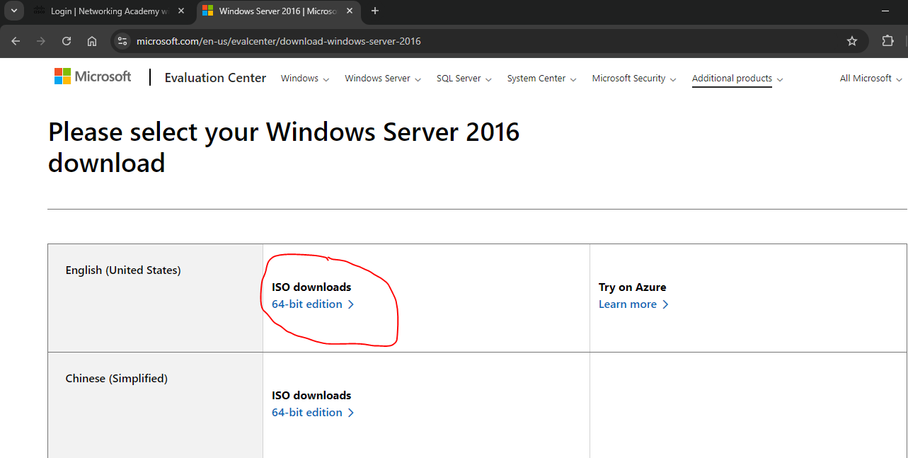
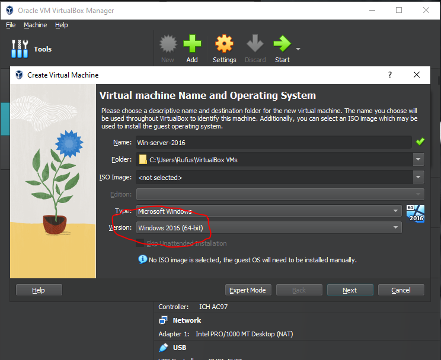

# Installing-windows-16-Vista
<h2>Step 1</h2>
Visit the official Microsoft website to download the Windows Server 2016 ISO (64-bit edition). Click the link to access and start your download.

<h2>Step 2 Create a New Virtual Machine:</h2>
If you haven’t installed VirtualBox yet, I’ve created a detailed guide to help you. Once installed, open VirtualBox and click ‘New’ to create and set up a new virtual machine.

<h2>Step 3 Name your machine:</h2>
You can name the virtual machine 'Windows Server 2016,' and the system should automatically set the version to Windows 2016 64-bit. If it doesn’t update automatically, ensure the correct version is manually selected and highlighted for accuracy.

<h2>Step 4 Create a Virtual Hard-disk:</h2>
It’s recommended to allocate at least 2GB of base memory for optimal performance. If your system has additional resources, you can increase the memory allocation to enhance functionality and ensure smoother operation.

Cycle through and complete by clicking Finish to create your virtual machine.

<h2>Step 5 Configure VM settings: </h2>
Open the virtual machine settings, navigate to the storage tab, and select the empty disk. Locate and insert the downloaded Server 2016 ISO file. Once inserted, click "OK" to save the changes and proceed with the setup.

<h2>Step 6: Start up the virtual machine</h2>
Click "Start" to launch the virtual machine and begin the installation process for the server, ensuring all necessary configurations are in place beforehand.
<h2>setting Up Windows Server 2016:</h2>

A blue boot screen will appear, followed by the setup screen. Select your preferred language, time, and keyboard format. Click "Next," then proceed by clicking "Install Now" to continue.

Select the desired version, preferably "Server 2016 Standard with Desktop Experience." Once chosen, click "Next" to proceed with the installation process.

Agree with the license terms, hit next

Type of install, choose custom

Make sure the drive is selected, hit next

The installation will complete and restart automatically. Avoid clicking anything as it boots into the setup. Let the process finish uninterrupted.

Choose Password

